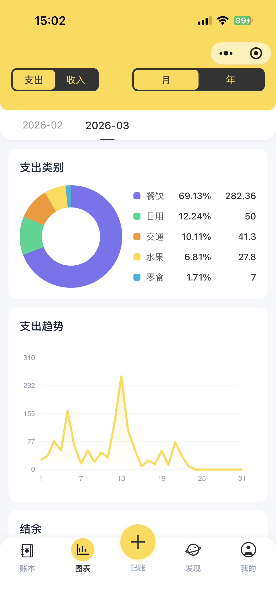
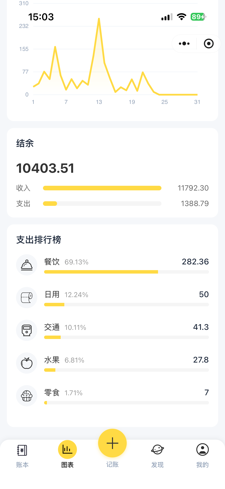

# 记账本 (Billing WxNimi)

一个基于微信小程序开发的个人记账财务管理应用。

## 在线体验


## 相关仓库

- **微信小程序**: 当前仓库
- **后端代码**: [https://github.com/chao69782/billing_java.git](https://github.com/chao69782/billing_java.git)


## 功能特性

### 📊 记账管理
- **记账记录**：快速记录日常收支
- **账本管理**：多账本管理功能
- **账单详情**：查看每笔账单的详细信息

### 📈 数据可视化
- **图表统计**：直观的收支图表展示
- **数据汇总**：按月/日统计收支情况

### 🧮 实用工具
- **计算器**：内置计算器功能
- **智能助手**：提供财务建议和提醒

### 👨‍👩‍👧 家庭功能
- **家庭账本**：支持家庭成员共同记账
- **数据共享**：家庭成员间账目共享

### 💬 反馈与建议
- **意见反馈**：提交使用问题和建议

## 界面预览

<table>
  <tr>
    <td align="center">
      
      <br/>记账
    </td>
    <td align="center">
      
      <br/>记账记录
    </td>
    <td align="center">
      
      <br/>结余汇总
    </td>
  </tr>
  <tr>
    <td align="center">
      
      <br/>图表统计1
    </td>
    <td align="center">
      
      <br/>图表统计2
    </td>
    <td align="center">
      
      <br/>发现
    </td>
  </tr>
  <tr>
    <td align="center">
      
      <br/>AI助手
    </td>
    <td align="center">
      
      <br/>家庭记账
    </td>
    <td align="center">
      
      <br/>我的
    </td>
  </tr>
  <tr>
    <td align="center">
      
      <br/>分类设置
    </td>
    <td align="center">
      
      <br/>自定义分类
    </td>
    <td align="center">
    </td>
  </tr>
</table>

## 项目结构

```
├── app.js              # 应用入口文件
├── app.json            # 应用配置
├── app.wxss            # 全局样式
├── components/         # 公共组件
│   ├── amount-editor/      # 金额编辑器
│   ├── category-picker/    # 分类选择器
│   ├── navigation-bar/     # 导航栏
│   └── custom-tab-bar/     # 自定义tabBar
├── pages/              # 页面文件
│   ├── assistant/      # 智能助手
│   ├── bill-detail/    # 账单详情
│   ├── calculator/     # 计算器
│   ├── charts/         # 图表统计
│   ├── discovery/      # 发现
│   ├── family/         # 家庭
│   ├── feedback/       # 反馈
│   ├── ledger/         # 账本管理
│   ├── mine/           # 我的
│   └── record/         # 记账
├── utils/              # 工具类
│   ├── date.js         # 日期处理工具
│   └── request.js      # 网络请求封装
└── assets/             # 静态资源
```

## 技术栈

- **框架**：微信小程序原生开发
- **样式**：WXML + WXSS
- **网络请求**：自定义封装 request 模块
- **数据存储**：本地存储 (wx.setStorage)

## 快速开始

### 环境要求
- 微信开发者工具
- 微信小程序 AppID

### 安装步骤

1. 克隆项目到本地：
```bash
git clone https://gitee.com/zhang-lichao/billing_mini.git
```

2. 使用微信开发者工具打开项目目录

3. 在微信开发者工具中预览项目

## 使用说明

### 首次使用
1. 打开小程序后，在「我的」页面进行用户信息设置
2. 开始记录第一笔收支

### 记账流程
1. 进入「记账」页面
2. 选择收支类型、分类、金额
3. 添加备注（可选）
4. 保存记录

### 查看统计
1. 进入「图表」页面查看收支分布
2. 可按月份筛选查看数据

## API 参考

### 网络请求封装 (utils/request.js)

```javascript
// GET 请求
GET(url, data, timeout)

// POST 请求
POST(url, data, timeout, useFormdata)

// PUT 请求
PUT(url, data, timeout, useFormdata)

// DELETE 请求
DEL(url, data, timeout, useFormdata)
```

### 日期工具 (utils/date.js)

```javascript
// 格式化日期
formatDate(isoStr)

// 补零
pad(n)

// 格式化显示日期
formatDisplayDate(isoStr)

// 格式化时间
formatTime(isoStr)

// 按日期分组记录
groupRecordsByDate(records)

// 获取月份汇总
getMonthSummary(records, year, month)
```

## 贡献指南

1. Fork 本仓库
2. 创建您的特性分支 (`git checkout -b feature/AmazingFeature`)
3. 提交您的更改 (`git commit -m 'Add some AmazingFeature'`)
4. 推送到分支 (`git push origin feature/AmazingFeature`)
5. 创建一个 Pull Request

## License

本项目仅供学习交流使用。

## 联系我

<div align="center">
  
  <br/>
  <p>扫一扫上面的二维码图案，加我为朋友。</p>
</div>